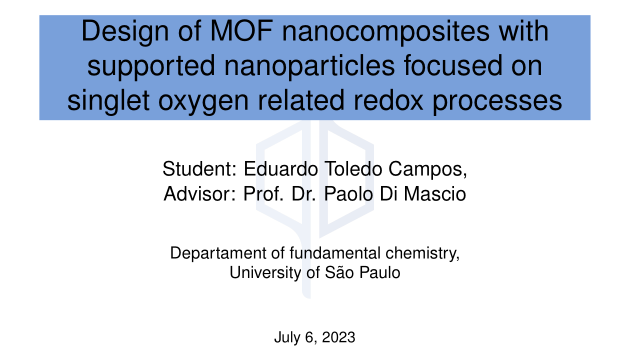
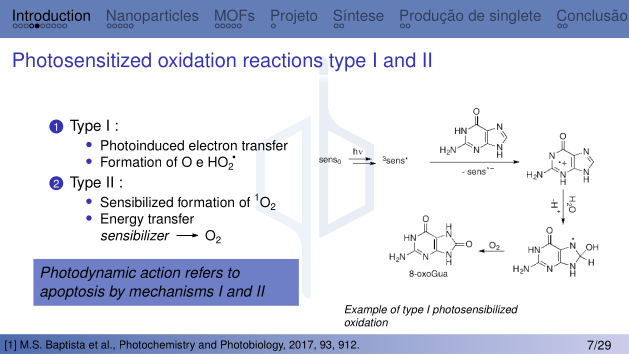
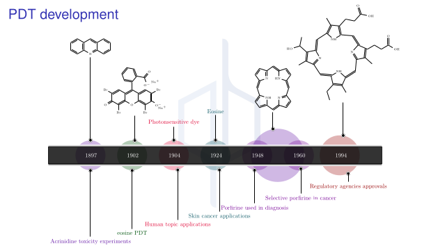

# IqUSPtex

---

---

|      Overleaf      |
| :----------------: |
| [![overbadge]][ol] |

[overbadge]: ./Slide_examples/overleaf.svg
[ol]: https://www.overleaf.com/read/qcftctcccgdg

**LaTeX beamer presentation theme, created for the University of São Paulo institue of chemistry (IQ-USP)**

**MIT License**

Copyright (c) <eduardotcampos@usp.br> **[2023]**

_This theme repository assumes user basic LaTeX knowledge to deal with it_

This beamer presentation is my personal master degree qualification presentation, in the singlet oxygen and photodynamic subareas, focused in inorganic materials. The present repo can be used as a base template for other presentations.

## Used packages

---

- Thanks to original latex timeline code creator claudio.fiandrino@gmail.com

- Github https://github.com/cfiandra/timeline tikzlibrarytimeline.code.tex moved
  to the Timeline and Project diagrams folders, the github also contains timeline
  example of latex file to be consulted.

- Chemformula and chemfig packages used in chemistry writings and drawings, can
  be removed if this 2 elements are not desired.

- Chemistry drawing are created by converting a .mol molecule file by the
  mol2chemfigPy3 python package, available in pypi and in
  https://github.com/Augus1999/mol2chemfigPy3

- Thanks to Augus1999 mol2chemfigPy3 creator.

## Compilation to pdf

---

- Compilating the latex file needs latexmk, as well as the used latex packages

- If you have already installed latex/texlive complete/full scheme, the installation
  bellow is not necessary

### Installation

#### Linux

##### Fedora

```bash
sudo dnf update
```

```bash
sudo dnf install make latexmk texstudio 'tex(beamer.cls)' 'tex(nicefrac.sty)' 'tex(graphicx.sty)' 'tex(chemformula.sty)' 'tex(tikz.sty)' 'tex(geometry.sty)' 'tex(ltxcmds.sty)' 'tex(infwarerr.sty)' 'tex(kvsetkeys.sty)' 'tex(kvdefinekeys.sty)' 'tex(pdfescape.sty)' 'tex(hycolor.sty)' 'tex(letltxmacro.sty)' 'tex(auxhook.sty)' 'tex(refcount.sty)' 'tex(kvoptions.sty)' 'tex(intcalc.sty)' 'tex(bitset.sty)' 'tex(bigintcalc.sty)' 'tex(rerunfilecheck.sty)' 'tex(uniquecounter.sty)' 'tex(grfext.sty)' 'tex(sansmathaccent.sty)' 'tex(srcltx.sty)' 'tex(translator.sty)' 'tex(amsthm.sty)' 'tex(lipsum.sty)' 'tex(helvet.sty)'
```

##### Ubuntu

```bash
sudo apt-get update
```

```bash
sudo apt install make latexmk texlive-latex-recommended texlive-latex-extra texlive-science
```

#### Windows

- Install perl from here https://strawberryperl.com

- Install mktex from here https://miktex.org/download

- Run main.tex in TeXworks, installing the requested packages, or manually install the following packages in MiKTeX:

  - latexmk, beamer.cls, geometry.sty ltxcmds.sty, infwarerr.sty, kvsetkeys.sty, kvdefinekeys.sty, pdfescape.sty,
    hycolor.sty, letltxmacro.sty, auxhook.sty, refcount.sty, gettilestring.sty, kvoptions.sty, intcalc.sty, bitset.sty,
    bigintcalc.sty, rerunfilecheck.sty, uniquecounter.sty, sansmathaccent.sty, scrlfile.sty, translator.sty, amsthm.sty,
    lipsum.sty, helvet.sty, nicefrac.sty, chemformula.sty, grfext.sty

### Compilation

#### linux

- On a terminal, inside the project folder, run

```bash
make
```

#### Windows

- Do one of the following possibilities:

  - Compile with TeXworks software

  - run the make.bat script

## Images

---

- Present in the Attachments folder.

- Background logo of the slides can be substituted in the Attachments folder by
  a desired one, that should be renamed to logo.png.

## Citations

---

- Quaderni degli Avogadro Colloquia style.

- Inserted in the footnote by adding the bellow lines to begin a frame, editing
  the subsection and blfootnote according to desired subsection name and citation

```LaTeX
\begingroup
\setbeamertemplate{footline}{}
\subsection{subsection name}
\begin{frame}
\blfootnote{[n] A.N Lastname et al., Periodic name, year, issue, page.}
```

- And the bellow line after endign the frame

```LaTeX
\endgroup
```

## subthemes

---

### beameroutertheme file

- Theme headline navigation bar

- image caption

- footnote and background logo.

### beamercolortheme file

- Contains the used color palette.

### beamerfonttheme file

- Font sizes and style.

### beamerinnertheme file

- Title page style

- Title page data

- Custom definition box style

## Observations

---

- Results part removed from the theme, due to not have being published yet.

## Slide examples

---







## Contributing

---

Feel free to make [pending](./TODO.md) or other optimizations and pull requests, this theme is still under development and any contribution is very much appreciated.
